# Warehouse Console Application

## Project Description
A .NET console application for warehouse management that handles pallets and boxes with the following requirements.

## Requirements

### Class Hierarchy
- **Pallet**:
  - Properties: `ID`, `Width`, `Height`, `Depth`, `Weight`, `Boxes` (list of boxes).
  - Can contain boxes.
  - Pallet expiration date is determined by the earliest expiration date of its boxes.
  - Weight = sum of box weights + 30kg.
  - Volume = sum of box volumes + (Width × Height × Depth).

- **Box**:
  - Properties: `ID`, `Width`, `Height`, `Depth`, `Weight`.
  - Must have either an `ExpirationDate` or `ProductionDate`.
    - If `ProductionDate` is provided, `ExpirationDate = ProductionDate + 100 days`.
    - Dates are stored without time (e.g., `01.01.2023`).
  - Volume = Width × Height × Depth.
  - Box dimensions must not exceed the containing pallet's width and depth.

### Console Application
1. **Data Input** (choose one method):
   - In-memory generation.
   - File or database reading.
   - User input.

2. **Output**:
   - Group all pallets by expiration date → sort groups by ascending expiration date → sort pallets in each group by weight.
   - Display the **top 3 pallets** with boxes having the furthest expiration dates, sorted by ascending volume.

### Optional
- Unit test coverage.
- Follow [Microsoft C# Coding Conventions](https://learn.microsoft.com/en-us/dotnet/csharp/fundamentals/coding-style/coding-conventions).
- *(Bonus)* Replace console app with a full UI (does not affect evaluation).

## Implementation Notes
- Use OOP principles for class design.
- Ensure proper validation (e.g., box fits pallet dimensions).
- Include error handling for data loading.  

# Domain models  

```mermaid  
classDiagram
    %% Value Objects
    class Address {
        +String street
        +String city
        +String state
        +String postalCode
        +String country
        +GeoCoordinate coordinates
    }

    class Dimensions {
        +decimal length
        +decimal width
        +decimal height
        +decimal volume
    }

    class TemperatureRange {
        +decimal minTemp
        +decimal maxTemp
    }

    class Barcode {
        +String code
        +BarcodeType type
    }

    class GeoCoordinate {
        +decimal latitude
        +decimal longitude
    }

    class LoadCapacity {
        +decimal maxWeight
        +decimal maxVolume
    }

    class ShelfLife {
        +TimeSpan duration
        +ShelfLifeType type
    }

    %% Enumerations
    class ItemStatus {
        <<enumeration>>
        IN_STOCK
        RESERVED
        IN_TRANSIT
        DAMAGED
        QUARANTINED
        DISPOSED
    }

    class DeliveryStatus {
        <<enumeration>>
        CREATED
        IN_TRANSIT
        ARRIVED
        UNLOADING
        INSPECTING
        COMPLETED
        DELAYED
        CANCELLED
    }

    class EquipmentType {
        <<enumeration>>
        FORKLIFT
        PALLET_JACK
        AGV
        CONVEYOR
        CRANE
        SENSOR
    }

    class BinStatus {
        <<enumeration>>
        AVAILABLE
        OCCUPIED
        RESERVED
        MAINTENANCE
        QUARANTINE
    }

    class TaskPriority {
        <<enumeration>>
        CRITICAL
        HIGH
        MEDIUM
        LOW
    }

    class MovementReason {
        <<enumeration>>
        RECEIVING
        PICKING
        REORGANIZATION
        QUALITY_CHECK
        INVENTORY_ADJUSTMENT
    }

    %% Relationships (if any)
    Address *-- GeoCoordinate
    Barcode --> BarcodeType
    Dimensions ..> VolumeCalculation
    ShelfLife --> ShelfLifeType
```  

  
# Entities  

